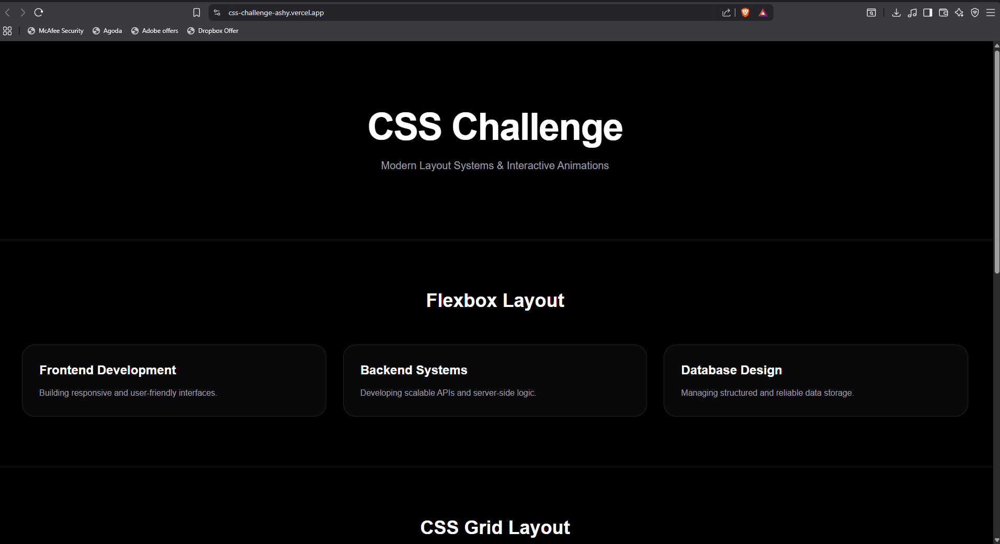
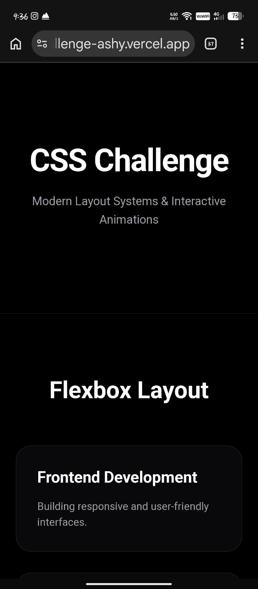
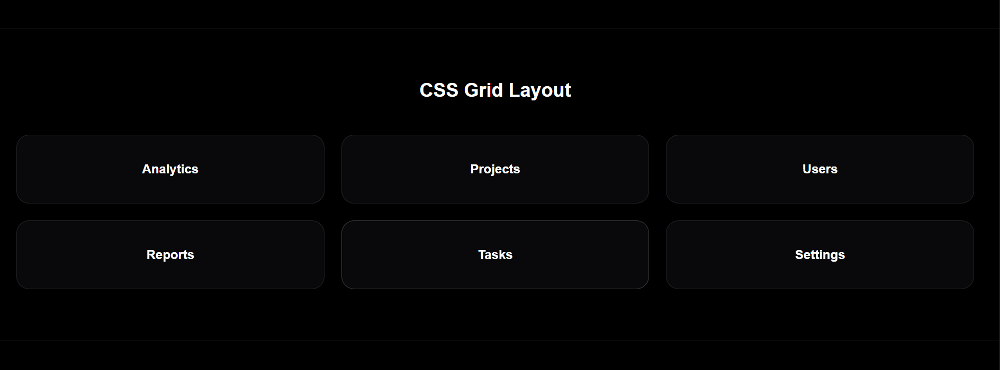
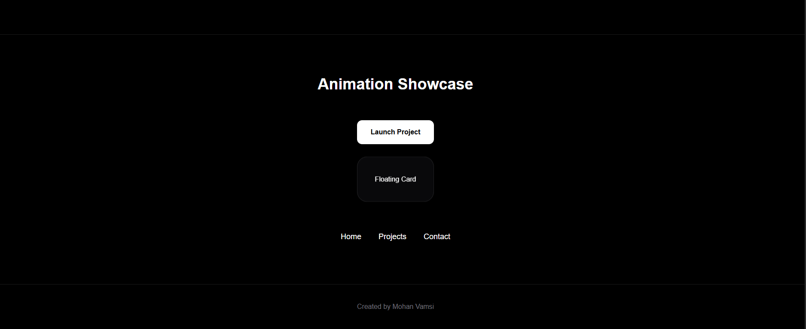

# CSS Challenge

## Overview

This project was created as part of the Web Development Internship Week 1 CSS Challenge. The objective of the challenge is to demonstrate proficiency in modern CSS layout techniques and animations using responsive design principles.

The project showcases:

* Flexbox Layout
* CSS Grid Layout
* Interactive CSS Animations
* Responsive Design
* Modern UI Components

## Live Demo

https://your-vercel-link.vercel.app/

## Features

### Flexbox Layout Challenge

* Three responsive cards
* Horizontal layout on desktop
* Vertical stacking on mobile devices
* Hover lift effect
* Proper spacing and alignment

### CSS Grid Challenge

* Six responsive dashboard cards
* CSS Grid implementation
* Adaptive column structure
* Consistent spacing and visual hierarchy

### Animation Showcase

* Interactive hover button animation
* Floating card animation
* Animated navigation underline effect
* Smooth transitions and micro-interactions

## Technologies Used

* Next.js
* React
* TypeScript
* Tailwind CSS
* Vercel

## Project Structure

css-challenge/
├── app/
│   ├── page.tsx
│   ├── layout.tsx
│   └── globals.css
│
├── screenshots/
│   ├── flex-desktop.png
│   ├── flex-mobile.png
│   ├── grid-layout.png
│   └── animation-demo.png
│
├── public/
├── README.md
├── package.json
└── ...

## Installation

### Clone Repository

git clone https://github.com/A-MOHAN-VAMSI/css-challenge.git

### Navigate to Project

cd css-challenge

### Install Dependencies

npm install

### Run Development Server

npm run dev

### Open Browser

http://localhost:3000

## Screenshots

### Flexbox Layout (Desktop)

### Flexbox Layout (Mobile)

### CSS Grid Layout

### Animation Showcase

## Learning Outcomes

Through this project, the following concepts were practiced:

* Responsive Design Principles
* Flexbox Layout System
* CSS Grid Layout System
* CSS Transitions
* Hover Effects
* Mobile-First Development
* Component-Based UI Design

## Author

Mohan Vamsi

GitHub:
https://github.com/A-MOHAN-VAMSI

LinkedIn:
https://www.linkedin.com/in/akula-mohan-vamsi-445a6936a/

## License

This project was developed for educational and internship purposes.
